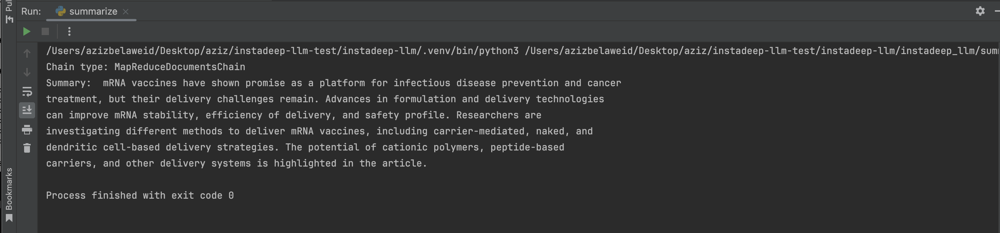
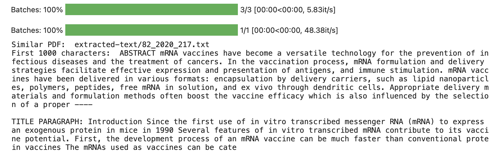
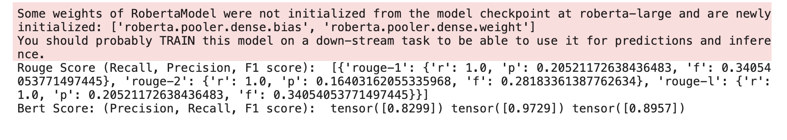

# LLM Project (Summarize And retrieve Papers)

## Setup

1. Install poetry: https://python-poetry.org/docs/#installation
2. Install dependencies: `poetry install`
3. Install LLAMA2 Chat weights

`
wget https://huggingface.co/TheBloke/Llama-2-7b-Chat-GGUF/resolve/main/llama-2-7b-chat.Q5_0.gguf
`

## Summarization

How to Run the summarization script

`
python3 instadeep_llm_test/summarization.py --file_path <path_to_pdf> --model_path <path_to_model> --verbose <whether to see complete logs or not>
`

## Retrieve Top 3 Papers

How to Run the retrieve top 3 papers script

`
python3 instadeep_llm_test/retrieve.py --query <query> --model_name <sentence_embedding_model> --verbose <whether to see complete logs or not> --top_k <number of papers to retrieve> --data_path <path to the data>
`

## Evaluate Results

Testing the summarization and retrieval scripts can be done using Rouge or BERT score to see if the
summary or the retrieved papers are relevant to the query.

To evaluate results for both summarization and retrieval, run the following command:

`
python3 instadeep_llm_test/evaluate.py --model_result <model's output> --ground_truth <ground truth> 
`

